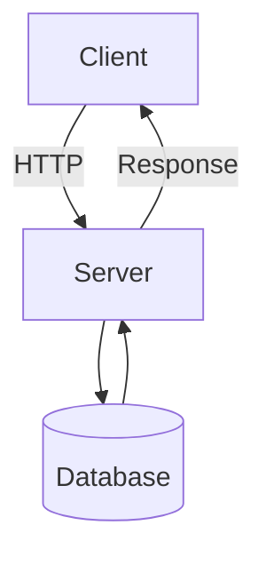

# H1

## H2

???
Welcome to the example presentation! This slide shows basic heading styles.

---
background: https://images.unsplash.com/photo-1548890126-91461beb4bf1?q=80&w=4470&auto=format&fit=crop&ixlib=rb-4.1.0&ixid=M3wxMjA3fDB8MHxwaG90by1wYWdlfHx8fGVufDB8fHx8fA%3D%3D

# Background Image

---
background: https://images.unsplash.com/photo-1548890126-91461beb4bf1?q=80&w=4470&auto=format&fit=crop&ixlib=rb-4.1.0&ixid=M3wxMjA3fDB8MHxwaG90by1wYWdlfHx8fGVufDB8fHx8fA%3D%3D
cover: true

# Cover Image

---

- Inline Image
- 

---
build: true

## List

- Item 1
- Item 2
- Item 3
- Item 4

???
Use `build: true` to reveal list items one by one. Press arrow keys or space to advance through each item.

---

## Code

```
const code = 'without syntax highlighting';
```

```js
const code = 'with syntax highlighting';
```

???
Code blocks support syntax highlighting via highlight.js. Use language identifiers after the opening triple backticks.

---

## Code with Line Numbers

```js linenums
const greeting = 'Hello';
const name = 'World';
console.log(`${greeting}, ${name}!`);
```

---

## Code with Highlighted Lines

```js h2
const line1 = 'normal';
const line2 = 'highlighted';
const line3 = 'normal';
```

---

## Line Numbers + Highlights

```js linenums h2 h4-6
function fibonacci(n) {
  if (n <= 1) return n;
  let a = 0, b = 1;
  for (let i = 2; i <= n; i++) {
    [a, b] = [b, a + b];
  }
  return b;
}
```

---

## Mermaid Diagram



---
type: section

# New Section

---

- *Emphasis*
- _Italic_
- Inline *Emphasis* and _Italic_
- [Link](#)

---
type: section

# Presenter Mode

---

## Presenter Notes

- Add notes with `???` on a line by itself
- Notes appear below the slide separator
- Notes are hidden in the audience view
- Only visible in presenter mode

???
These are presenter notes.
Only you can see them!

This slide demonstrates how presenter notes work. The `???` marker separates visible slide content from private notes.

---

## Opening Presenter Mode

- Press `P` during any presentation
- Current window becomes the presenter view
- A viewer window opens automatically for the audience
- Click `+ Viewer` to open additional viewer windows
- All windows stay in sync

???
Demonstrate by pressing P right now. You can also add `?mode=presenter` to the URL manually.

---
type: section

# Layouts & Templates

---
template: two-column

::left::

## Left Column

- Layouts add persistent chrome
- Header, footer, watermark
- Supports slide number placeholders

::right::

## Right Column

- Templates arrange content
- Named slots with `::name::` syntax
- Built-in: default, two-column, title-content

---
template: title-content

::title::

## Template: title-content

::default::

- The title area is visually separated from the body
- Content flows naturally below the divider
- Great for slides with a clear heading and supporting details

???
The title-content template separates heading from body with a visual divider. Great for structured slides.

---
template: two-column

## Before

```js
// Before
function greet(name) {
  return 'Hello ' + name;
}
```

::right::

## After

```js
// After
const greet = (name) =>
  `Hello ${name}`;
```

---
template: highlight-box

::accent::

## Custom Templates

::default::

- This slide uses a custom `highlight-box` template
- Defined in `lets-talk-about.config.js`
- Styled via `custom.css`
- Templates are just functions: `(slots) => html`
